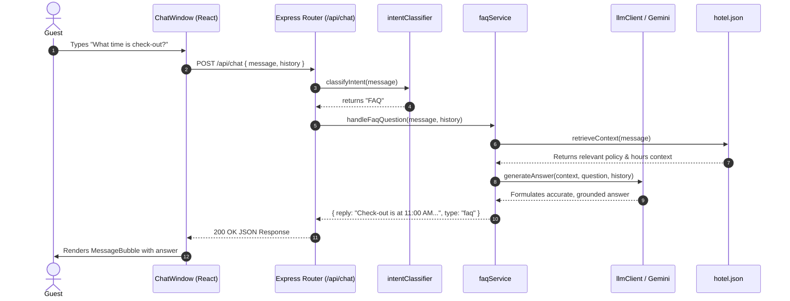
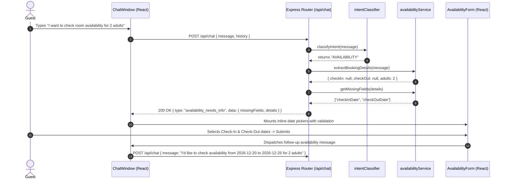
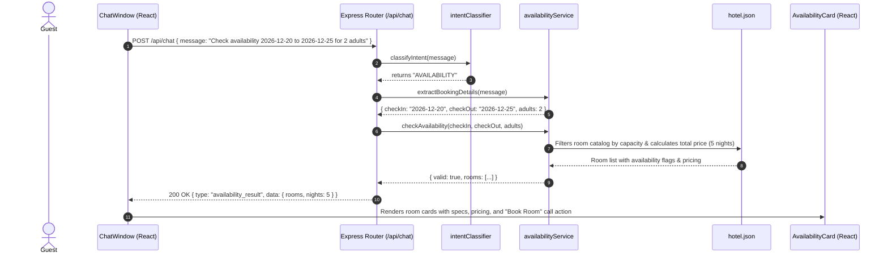
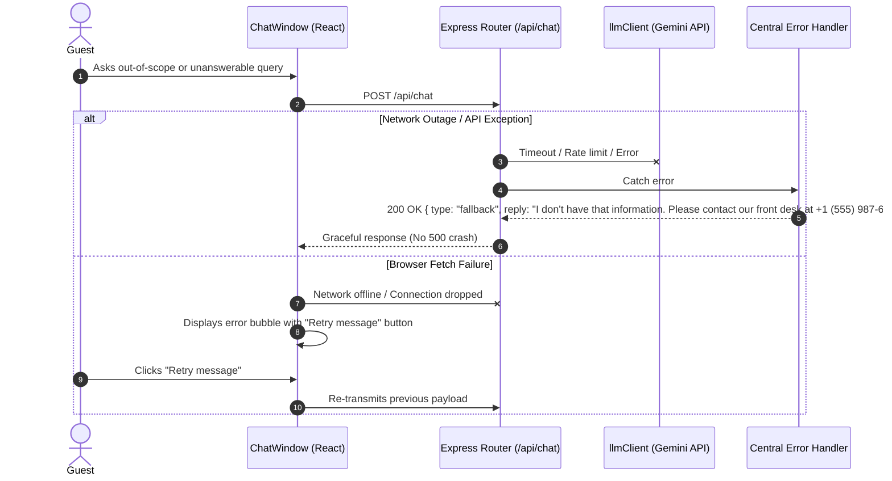

# System Architecture & Workflows

This document outlines the complete architectural design, component separation, data flow, and sequence workflows for **The Grand Horizon Hotel AI Guest Assistant**.

---

## 1. Architectural Overview & Layering

The system is designed with a **layered, decoupled architecture** separating presentation, API routing, business logic, RAG retrieval, and AI orchestration.

```
┌──────────────────────────────────────────────────────────────────────────────────────────────────┐
│                                     PRESENTATION LAYER (React)                                   │
│  App.jsx                                                                                         │
│  ├── Header (Branding, Status, Direct Phone Link)                                                │
│  └── ChatWindow.jsx (State orchestration, Auto-focus, Suggestions)                               │
│       ├── MessageBubble.jsx (User & Assistant bubbles, Timestamps)                               │
│       ├── TypingIndicator.jsx (Smooth bounce animation)                                          │
│       ├── AvailabilityCard.jsx (Structured room results, pricing, booking trigger)              │
│       └── AvailabilityForm.jsx (Dynamic missing-parameter collection)                            │
└──────────────────────────────────────────────────────────────────────────────────────────────────┘
                                                │
                                                ▼ HTTP / REST (chatApi.js)
┌──────────────────────────────────────────────────────────────────────────────────────────────────┐
│                                   API & GATEWAY LAYER (Express)                                  │
│  server.js ──► app.js                                                                            │
│  ├── CORS Filter (Whitelist allowed origins)                                                     │
│  ├── JSON Body Parser                                                                            │
│  ├── Request Logger (Structured JSON with timestamps)                                            │
│  └── validateChatRequest.js (Body sanity, trimming, string safety)                                │
└──────────────────────────────────────────────────────────────────────────────────────────────────┘
                                                │
                                                ▼
┌──────────────────────────────────────────────────────────────────────────────────────────────────┐
│                              NLP & INTENT CLASSIFICATION LAYER                                   │
│  intentClassifier.js                                                                             │
│  ├── Rule-based pattern matching (Regex + Contextual Token Analysis)                             │
│  ├── Name & Origin extraction (Sanitized stop-word filtering)                                    │
│  └── Classifies: GREETING | INTRODUCTION | AVAILABILITY | FAQ                                    │
└──────────────────────────────────────────────────────────────────────────────────────────────────┘
                                                │
                   ┌────────────────────────────┴────────────────────────────┐
                   ▼                                                         ▼
┌──────────────────────────────────────┐  ┌────────────────────────────────────────────────────────┐
│     DETERMINISTIC DOMAIN SERVICE     │  │                CONVERSATIONAL RAG & AI                 │
│  availabilityService.js              │  │  faqService.js                                         │
│  ├── chrono-node Natural Date Parser │  │  ├── Token Overlap Context Retrieval                   │
│  ├── Multi-night calculations        │  │  ├── System Prompt Guardrails (Zero Hallucinations)    │
│  ├── Guest capacity verification     │  │  └── llmClient.js                                      │
│  └── Static Inventory Query          │  │       ├── USE_LLM=true  ──► Google Gemini API          │
│                                      │  │       └── USE_LLM=false ──► templateResponder.js      │
└──────────────────────────────────────┘  └────────────────────────────────────────────────────────┘
                   │                                                         │
                   └────────────────────────────┬────────────────────────────┘
                                                ▼
┌──────────────────────────────────────────────────────────────────────────────────────────────────┐
│                                          DATA LAYER                                              │
│  server/data/hotel.json                                                                          │
│  ├── Hotel Metadata (Name, Address, Phone, Star Rating)                                          │
│  ├── Policies (Check-in, Check-out, Early/Late, Cancellation, Pet, Smoking)                      │
│  ├── Amenities (Pool, Gym, Spa, Dining, WiFi, Parking, Business Center, Shuttle)                 │
│  ├── Room Catalog (Inventory, Max Adults/Children, Dimensions, Pricing)                          │
│  └── FAQ Knowledge Base                                                                          │
└──────────────────────────────────────────────────────────────────────────────────────────────────┘
```

---

## 2. Sequence Workflows

### Workflow A: General Hotel FAQ Query (RAG Flow)


---

### Workflow B: Availability Request with Missing Parameters


---

### Workflow C: Full Availability Calculation & Card Presentation


---

### Workflow D: Graceful Error & Fallback Recovery


---

## 3. Component Responsibilities

| Layer / Component | File | Responsibilities |
|---|---|---|
| **App Shell** | `client/src/App.jsx` | Layout container, responsive header, active status indicator, direct telephone link. |
| **Chat Orchestrator** | `client/src/components/ChatWindow.jsx` | Conversation state, auto-scroll ref, persistent input focus retention, suggestion pills, reset chat action. |
| **Message View** | `client/src/components/MessageBubble.jsx` | Renders user and assistant bubbles, timestamps, avatars, and embeds dynamic child components. |
| **Availability Form** | `client/src/components/AvailabilityForm.jsx` | Dynamic form for missing date/guest fields with dynamic min date and date-range validation. |
| **Availability Cards** | `client/src/components/AvailabilityCard.jsx` | Scannable room cards displaying capacity, size, nightly and total pricing, availability status, and booking trigger. |
| **API Client** | `client/src/api/chatApi.js` | Single point of network communication to `POST /api/chat`. |
| **Server Gateway** | `server/src/app.js` | Express app setup, CORS whitelist, JSON parsing, request logging, and health endpoint. |
| **Chat Route** | `server/src/routes/chat.js` | Controller routing user requests to introduction, greeting, availability, or FAQ handlers. |
| **Intent Classifier** | `server/src/services/intentClassifier.js` | Deterministic intent classification (GREETING, INTRODUCTION, AVAILABILITY, FAQ) and name extraction. |
| **Availability Service** | `server/src/services/availabilityService.js` | Natural language date parsing (`chrono-node`), missing-field detection, and multi-night price calculation. |
| **FAQ & RAG Service** | `server/src/services/faqService.js` | Tokenizes user query, scores knowledge base sections, and builds strictly grounded RAG context. |
| **LLM Gateway** | `server/src/services/llmClient.js` | Dispatches RAG prompt to Google Gemini API or falls back to template responder. |
| **Template Responder** | `server/src/services/templateResponder.js` | Deterministic offline response generator for all hotel queries, timings, amenities, and policies. |
| **Logger** | `server/src/utils/logger.js` | Structured JSON-line logger with ISO timestamps for request and error tracing. |

---

## 4. Key Architectural Decisions

1. **Separation of Deterministic vs. Probabilistic Logic**:
   - **Deterministic**: Room availability checking, date arithmetic, pricing calculations, and body validation.
   - **Probabilistic (LLM)**: Natural language summarization, varied conversational phrasing, and friendly tone generation.
2. **Context-Grounded RAG Guardrails**:
   - System prompts strictly forbid the model from guessing or fabricating details.
   - Ambiguous queries return structured fallback messages containing verified contact channels.
3. **No Direct Frontend-to-LLM Calls**:
   - Prevents exposing API keys or secrets in client bundles.
   - Ensures all user input is sanitized, validated, and logged centrally.
